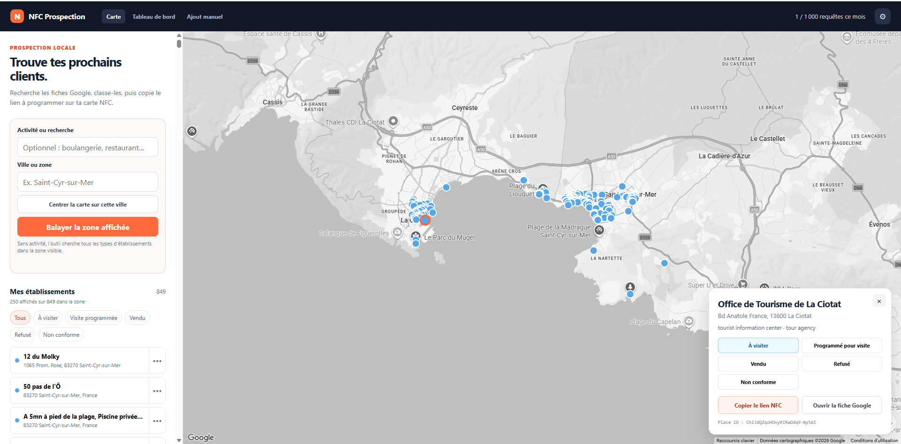

# NFC Prospection

Outil local pour rechercher des établissements Google, suivre leur statut commercial et copier un lien Google Maps à encoder sur une carte NFC.

## Application preview

## Démarrage

1. Lancez `server.py` puis ouvrez `http://127.0.0.1:4173/` ; ne double-cliquez pas simplement sur `index.html`.
2. Les données sont sauvegardées automatiquement dans `C:\Users\Dell\Documents\Projet Google Add\NFC prospection\prospection.json`.
3. Cliquez sur le réglage ⚙ et collez votre clé Google Maps API. Elle est conservée uniquement dans le stockage local de ce navigateur.

La clé doit avoir les deux restrictions d’API suivantes : Maps JavaScript API et Places API, ainsi que des restrictions de site web incluant `http://localhost/*` et `http://127.0.0.1/*`.

## Version en ligne (Netlify + Supabase)

Le site déployé est protégé par un compte unique : toute page ouverte sans session valide
renvoie vers `login.html`, et aucune donnée d’établissement n’est demandée avant la connexion.

- **Provisionner** Supabase et Netlify : `./scripts/provision.sh` (assistant pas à pas).
  Il crée le projet, applique `supabase/migrations/`, crée l’unique compte, désactive
  l’inscription publique, relie Netlify au dépôt et remplit `.env`.
- **Construire le site** : `npm ci && SUPABASE_URL=… SUPABASE_ANON_KEY=… npm run build`.
  La construction assemble `dist/` (pages statiques + `config.js` + bundles `nfc-*.js`) ;
  c’est le seul dossier publié. Netlify exécute la même commande à chaque `push` sur `main`.
  Pour ouvrir l’application localement, servez `dist/` (les pages restent vides sans
  construction préalable : le bundle de connexion est manquant).
- **Tester** : `npm test`. Les tests d’intégration du RPC `increment_quota` ne s’exécutent
  que si `.env` fournit un projet Supabase (`set -a && . ./.env && set +a && npm test`).

Tout accès à Supabase passe par `src/store.js` (« le store ») : c’est le seul module qui
parle à la base. La clé `service_role` reste locale et n’est jamais publiée.

## Limites de sécurité

- 50 nouveaux établissements par jour
- 1 000 nouveaux établissements par mois

Un même établissement n’est compté qu’une seule fois : son `place_id` sert de dédoublonnage.
